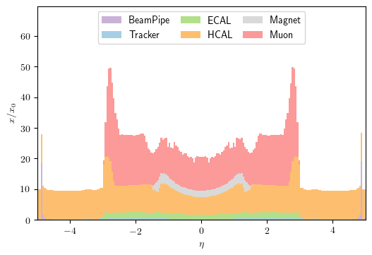
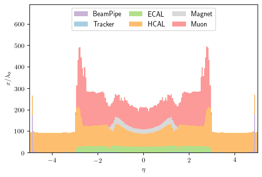

# CMS-Material-Budget

Collect and plot the material budget of the CMS detector

## How to run

Install and setup your favourite CMSSW (e.g. `10_1_5`):

```
cmsrel CMSSW_10_1_5
cd CMSSW_10_1_5/src
cmsenv
cd -
```

First step is to run the single neutrino gun:

```
mkdir data
cmsRun single_neutrino_cfg.py maxEvents=10000 outputFile=file:data/single_neutrino.root
```

Next step generates a tree with the relevent information on the material budget:

```
cmsRun material_budget_cfg.py inputFiles=file:data/single_neutrino.root outputFile=file:data/matbdg_det-{}.root # geometry=GeometryExtended2017Plan1
```

An example of how to process the output of this is shown in ```draw.ipynb```
with the resulting distributions:



